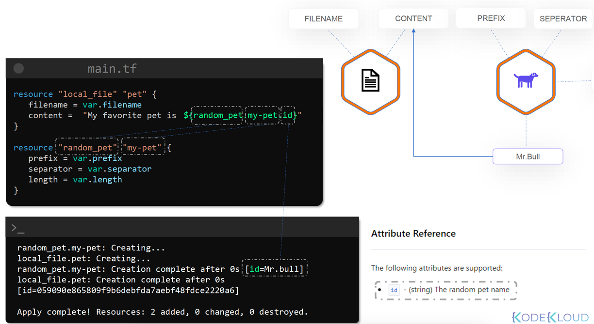
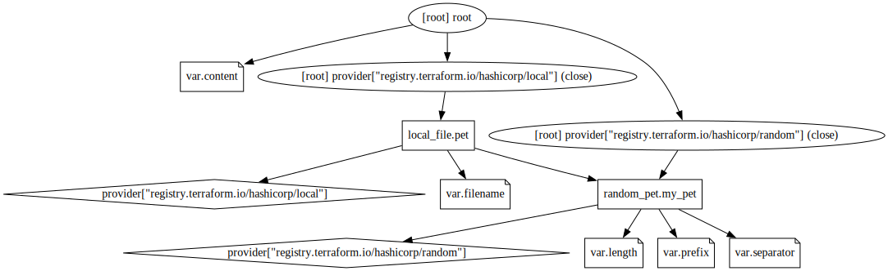
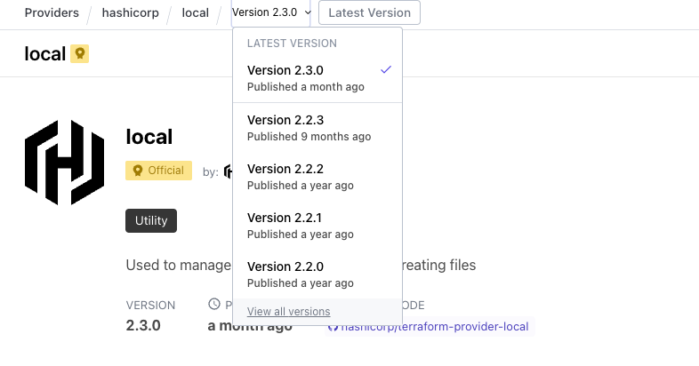
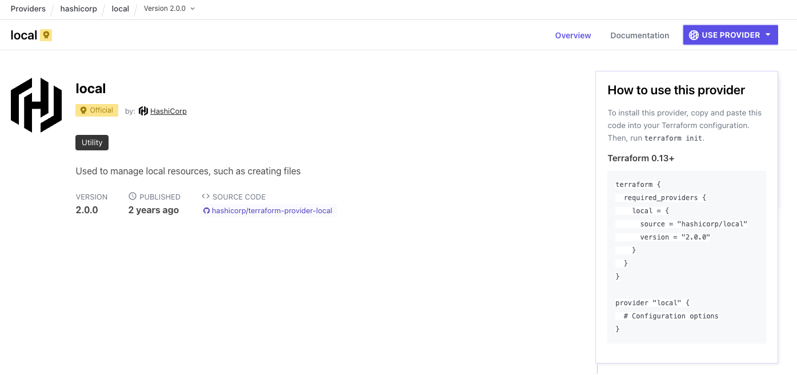

# Terraform

## [Docker](https://learn.hashicorp.com/tutorials/terraform/docker-variables?in=terraform/docker-get-started)

### Build infrastructure.

#### The main.tf file

##### Terraform block

The terraform{} block contains Terraform settings, including the required providers Terraform will use to provision your infrastructure.
- **source**: defines an optional hostname, namespace and the provider type. Terraform install providers from the [registry](https://registry.terraform.io/) by default. In this example the docker provider source is defined as **kreuzwerker/docker**.
- **version**: An optional attribute defined in the **required_providers** block. Is recommended to use thsi attribute to constrain the provider version so that Terraform doesn't install the latest version by default.

```
terraform {
  required_providers {
    docker = {
      source  = "kreuzwerker/docker"
      version = "~> 2.13.0"
    }
  }
}
```

#### Providers block

Configures the specified provider, in this case docker. A provider is a plugin that Terraform uses to create and manage resources. You can use multiple providers blocks in your configuration to manage resources from different rpoviders. You can even use different providers together. For example you could pass the Docker image ID to a Kubernetes service.
```
provider "docker" {}
```
#### Resources block
Defines components of your infrastructure, a resource might be a physical or virtual component such a Dokcer container, or it can be a logical resource such as a Heroku application.

Resource blocks have two strings before the block: te resource type and the resource name. In this example, resource type is docker-image and the name is nginx. The prefix of the type maps to the name of the provider. The resource type and name form a unique ID for the resource. e.g.: **docker_image.nginx**. Resource blocks contain arguments which you use to configure the resource; machine sizes, disk image names, or VPC IDs.

```
resource "docker_image" "nginx" {
  name         = "nginx:latest"
  keep_locally = false
}

resource "docker_container" "nginx" {
  image = docker_image.nginx.latest
  name  = "tutorial"
  ports {
    internal = 80
    external = 8080
  }
}
```

### Initialize the directory
When you create a new configuration-or check out an existing configuration from version control-is necessary to initialize the directory with ```terraform init```.
Initializing a configuration directory downloads and installs the providers defined in the configuration, docker in this case.
### Create infraestructure.
```terraform apply```
Will apply the configuration from the **main.tf** file.
### Change infrastructure
Update the configuration file by changing the container external port.
```
resource "docker_container" "nginx" {
  image = docker_image.nginx.latest
  name  = "tutorial"
  hostname = "learn-terraform-docker"
  ports {
    internal = 80
-   external = 8000
+   external = 8080
  }
}
```
Apply the changes ```terraform apply```

### Destroy infrastructure
The command ```terraform destroy``` terminates resources managed by the project.

### Input variables
Create new filled called **variables.tf** with a block defining a new container_name variable.
```
variable "container_name" {
  description = "Value of the name for the Docker container"
  type        = string
  default     = "ExampleNginxContainer"
}

```
In the **main.tf**, update the **docker_container** resource block to use the new variable. The **container_name** variable block will default to its value unless you declare a different one.

```
resource "docker_container" "nginx" {
  image = docker_image.nginx.latest
- name  = "tutorial"
+ name  = var.container_name
  ports {
    internal = 80
    external = 8080
  }
}
```
Checking the docker running containers:
```
CONTAINER ID   IMAGE          COMMAND                  CREATED          STATUS          PORTS                  NAMES
fa854c65348e   2e7e2ec411a6   "/docker-entrypoint.…"   40 seconds ago   Up 39 seconds   0.0.0.0:8080->80/tcp   ExampleNginxContainer
```

### Query data with outputs
Create a file called **output.tf**, add the following to define the outputs for the container's ID and the image ID:
```
output "container_id" {
  description = "ID of the Docker container"
  value       = docker_container.nginx.id
}

output "image_id" {
  description = "ID of the Docker image"
  value       = docker_image.nginx.id
}
```
Apply the configuration:
```
Changes to Outputs:
  + container_id = "fa854c65348ec911ac59460382d07485ce77a4589e5899da5f39f682e6a3e1e2"
  + image_id     = "sha256:2e7e2ec411a6fdeee34c78b4d41d9a7f6d4cd311f320f03bcec11a239f524341nginx:latest"

You can apply this plan to save these new output values to the Terraform state, without changing any real infrastructure.
```
Execute ```terraform output``` command:
```
terraform output
container_id = "fa854c65348ec911ac59460382d07485ce77a4589e5899da5f39f682e6a3e1e2"
image_id = "sha256:2e7e2ec411a6fdeee34c78b4d41d9a7f6d4cd311f320f03bcec11a239f524341nginx:latest"
```
Terraform outputs can be used to connect Terraform projects with other parts of the infrastructure or with other projects.

## Variables

Variables are usually defined in the `variables.tf' configuration file:

**variables.tf**
```
variable "filename" {
    default = "/root/pets.txt"
}

variable "content" {
    default = "we love pets!"
}

variable "prefix" {
    default = "Mrs."
}
```
And used in the `main.tf` configuration file like this:

**main.tf**
```
resource "local_file" "pet" {
    filename = var.filename
    content = var.content
}
```

### Variables can be defined in multiple ways:

- Command line flags:
```
terraform apply -var "filename=/root/pets.txt" -var "content=we love pets!" - var "prefix=Mrs." ....
```

- Environment variables:
```
export TF_VAR_filename="/root/pets.txt"
export TF_VAR_content="We love pets!"
export TF_VAR_prefix="Mrs."
```

- Variable definition files (when there are too many variables):

files named like: terraform.tfvars / terraform.tfvars.json /*.auto.tfvars/*auto.tfvars.json, will be loaded automatically by terraform.
```
filename="/root/pets.txt"
content="We love pets!"
prefix="Mrs."
```

If any other file name format is used it should be passed as argument for the apply:
```
terraform apply -var-file variables.tfvars
```

### Variable definition precedence
1. **-var or -var-file** (commandline flags)
2. ***.auto.tfvars** (alphabetical order)
3. **terraform.tfvars**
4. Environment variables

There are multiple variable types:

- **string:** “/root/pets.txt”
- **number:** 1
- :**bool:** true/flase
- **any:** Default value
- **list:** [“cat”, “dog”]
- **map:**
    pet1 = cat
    pet2 = dog
- **object:**
```
    variable "bella" {
        type = object({
            name = string
            color = string 
            food = list (string)
        })
       default = {
            name = "angelica"
            color = "black"
            food = ["banana", "mango", "kiwi"]
       }
   }

```
- **tuple:**
```
    variable kitty {
          type = tuple[string, number, bool]
          default = ["cat", 9, true]
    }
```

## Resource Attributes

Output from one resource could be used as parameters for creating other resources.


Some other resources doesn't need any attribute as the time_static resource type

```
resource "time_static" "time_update" {
}

resource "local_file" "time" {
    filename = "/root/time.txt"
    content = "Time stamp of this file is ${time_static.time_update.id}"
}
```
Executing terraform plan command looks like: 
```
Terraform will perform the following actions:

  # local_file.time will be created
   -/+ resource "local_file" "time" {
      ~ content              = "Time stamp of this file is {time_static.time_update.id}" -> "Time stamp of this file is 2023-02-06T19:06:04Z" # forces replacement
        directory_permission = "0777"
        file_permission      = "0777"
        filename             = "/root/time.txt"
      ~ id                   = "29c3ddf9d9e875a87d3f435d4848bb784a65ab2c" -> (known after apply)
    }

  # time_static.time_update will be created
  + resource "time_static" "time_update" {
      + day     = (known after apply)
      + hour    = (known after apply)
      + id      = (known after apply)
      + minute  = (known after apply)
      + month   = (known after apply)
      + rfc3339 = (known after apply)
      + second  = (known after apply)
      + unix    = (known after apply)
      + year    = (known after apply)
    }
```

### Resource dependencies

By specifying a dependency, terraform makes sure the resource will be created after it's dependency is created, multiple
dependencies can be defined as a list.

**Implicit dependency**: the resource A makes use of any of the arguments from resource B (depends_on not needed)  
```
resource "time_static" "time_update" {
}

resource "local_file" "time" {
    filename = "/root/time.txt"
    content = "Time stamp of this file is ${time_static.time_update.id}"
}
```
**Explicit dependency**: resource A references explicitly any of the properties from resource B

```
resource "time_static" "time_update" {
}

resource "local_file" "time" {
    filename = "/root/time.txt"
    content = "Time stamp of this file is ${time_static.time_update.id}"
    depends_on = [time_static.time_update]
}
```

another example explicit dependency

```
resource "local_file" "whale" {
    filename = "/root/whale"
    content = "whale"
    depends_on = [local_file.krill]
}

resource "local_file" "krill" {
    filename = "/root/krill"
    content = "krill"
}
```
terraform plan
```
# local_file.krill will be created
+ resource "local_file" "krill" {
    + content              = "krill"
    + directory_permission = "0777"
    + file_permission      = "0777"
    + filename             = "/root/krill"
    + id                   = (known after apply)
      }

# local_file.whale will be created
+ resource "local_file" "whale" {
    + content              = "whale"
    + directory_permission = "0777"
    + file_permission      = "0777"
    + filename             = "/root/whale"
    + id                   = (known after apply)
      }
```

## Output variables

defined using the `output` keyword, reference resources outputs
**main.tf**
```
resource "local_file" "welcome" {
  filename = "./pets.txt"
  content = "Pets are welcome"
}

```
**output.tf**
```
output "welcome_message" {
  value = local_file.welcome.content
}
```
**Terraform plan:**
```
  # local_file.welcome will be created
  + resource "local_file" "welcome" {
      + content              = "Pets are welcome"
      + directory_permission = "0777"
      + file_permission      = "0777"
      + filename             = "./pets.txt"
      + id                   = (known after apply)
    }

Plan: 1 to add, 0 to change, 0 to destroy.

Changes to Outputs:
  + welcome_message = "Pets are welcome"

```

Terraform output command will show the output defined variables.
```
welcome_message = "Pets are welcome"
```

## Additional commands.

### Validate
Will validate if the configuration is correct or show the errors in the files.

`terraform validate`

```
Success! The configuration is valid.
```
**OR**

**main.tf**
```
resource "local_file" "pet" {
  filename = var.filename
  content = "My favorite pets is ${random_pe.my_pet.id}"
  file_permission = "0700"
}

resource "random_pe" "my_pet" {
  prefix = var.prefix
  separator = var.separator
  length = var.length
}
```
**output**
```
╷
│ Error: Missing required provider
│ 
│ This configuration requires provider registry.terraform.io/hashicorp/local, but that provider isn't available. You may be able to install it automatically by running:
│   terraform init
╵
╷
│ Error: Missing required provider
│ 
│ This configuration requires provider registry.terraform.io/hashicorp/random, but that provider isn't available. You may be able to install it automatically by running:
│   terraform init
╵
```

### terraform fmt
Will format the configuration files

**main.tf**
```
resource "local_file" "pet" {
      filename = var.filename
                      content  = "My favorite pets is ${random_pet.my_pet.id}"
file_permission = "0700"
}
```

```terraform fmt```

```
resource "local_file" "pet" {
  filename        = var.filename
  content         = "My favorite pets is ${random_pet.my_pet.id}"
  file_permission = "0700"
}
```

### show

Show the terraform state, can be formatted as JSON

```
terraform show -json

{
   "format_version":"1.0",
   "terraform_version":"1.3.7",
   "values":{
      "root_module":{
         "resources":[
            {
               "address":"local_file.pet",
               "mode":"managed",
               "type":"local_file",
               "name":"pet",
               "provider_name":"registry.terraform.io/hashicorp/local",
               "schema_version":0,
               "values":{
                  "content":"My favorite pets is Mrs.credible.emu",
                  "content_base64":null,
                  "directory_permission":"0777",
                  "file_permission":"0700",
                  "filename":"./files/test/pets.txt",
                  "id":"dbb026eb147bc53d266f4e5bf219cb77d754bdc0",
                  "sensitive_content":null,
                  "source":null
               },
               "sensitive_values":{
                  
               },
               "depends_on":[
                  "random_pet.my_pet"
               ]
            },
            {
               "address":"random_pet.my_pet",
               "mode":"managed",
               "type":"random_pet",
               "name":"my_pet",
               "provider_name":"registry.terraform.io/hashicorp/random",
               "schema_version":0,
               "values":{
                  "id":"Mrs.credible.emu",
                  "keepers":null,
                  "length":2,
                  "prefix":"Mrs",
                  "separator":"."
               },
               "sensitive_values":{
                  
               }
            }
         ]
      }
   }
}
```

```
terraform show

# local_file.pet:
resource "local_file" "pet" {
    content              = "My favorite pets is Mrs.credible.emu"
    directory_permission = "0777"
    file_permission      = "0700"
    filename             = "./files/test/pets.txt"
    id                   = "dbb026eb147bc53d266f4e5bf219cb77d754bdc0"
}

# random_pet.my_pet:
resource "random_pet" "my_pet" {
    id        = "Mrs.credible.emu"
    length    = 2
    prefix    = "Mrs"
    separator = "."
}
```

### providers
Shows configuration required providers

```
terraform providers 

Providers required by configuration:
.
├── provider[registry.terraform.io/hashicorp/local]
└── provider[registry.terraform.io/hashicorp/random]

Providers required by state:

    provider[registry.terraform.io/hashicorp/local]

    provider[registry.terraform.io/hashicorp/random]
```

### terraform providers mirror <directory>
Will download the needed providers specified in the configuration files
```
terraform providers mirror ./

- Mirroring hashicorp/local...
  - Selected v2.3.0 with no constraints
  - Downloading package for darwin_arm64...
  - Package authenticated: signed by HashiCorp
- Mirroring hashicorp/random...
  - Selected v3.4.3 with no constraints
  - Downloading package for darwin_arm64...
  - Package authenticated: signed by HashiCorp
```

### refresh
Refresh the state comparing to a remote or centralized state

```
terraform refresh

random_pet.my_pet: Refreshing state... [id=Mrs.credible.emu]
local_file.pet: Refreshing state... [id=dbb026eb147bc53d266f4e5bf219cb77d754bdc0]
```

### graph 
creates a graph based on the terraform plan

Install needed library
```
brew install graphviz
```

```
terraform graph | dot -Tsvg > graph.svg
```



## Immutable vs Mutable infrastructure

Installing updated for nginx into different servers is an example of mutable infrastructure, as the versions can be updated.
The versions may differ, leading to complexity increase. In teh other hand, the permissions for a file can be update it, 
the file will be delete it, and a new one created, the same happen to immutable infrastructures, resources will be replaced 
with new ones with the specified features. 

## Lifecycle Rules

- **create_before_destroy**: Creates the resource before destroying it's previous version.
- **prevent_destroy**: Terraform will throw an error if there in an attempt of destroying the resource (terraform destroy will destroy the resource) 
- **ignore_changes**: The resource will remain untouched

### Create before destroy

**main.tf**
A new file with 0777 permissions will be created.
```
resource "local_file" "pet" {
  filename        = var.filename
  content         = "My favorite pets is ${random_pet.my_pet.id}"
  file_permission = "0777"
}

resource "random_pet" "my_pet" {
  prefix    = var.prefix
  separator = var.separator
  length    = var.length
}
```

Marking the resource as "create_before_destroy" and changing file permissions to `0700`
**main.tf**

```
resource "local_file" "pet" {
  filename        = var.filename
  content         = "My favorite pets is ${random_pet.my_pet.id}"
  file_permission = "0777"   
  lifecycle {
    create_before_destroy = true
  }
}
```
**terraform plan**
```
+/- create replacement and then destroy  <-----

Terraform will perform the following actions:

# local_file.pet must be replaced
+/- resource "local_file" "pet" {
~ file_permission      = "0777" -> "0700" # forces replacement
~ id                   = "dbb026eb147bc53d266f4e5bf219cb77d754bdc0" -> (known after apply)
# (3 unchanged attributes hidden)
}
```

**terraform apply**

```
local_file.pet: Creating...
local_file.pet: Creation complete after 0s [id=dbb026eb147bc53d266f4e5bf219cb77d754bdc0]
local_file.pet (deposed object 6a80feb1): Destroying... [id=dbb026eb147bc53d266f4e5bf219cb77d754bdc0]
local_file.pet: Destruction complete after 0s
```

### prevent destroy
**main.tf**

```
resource "local_file" "pet" {
  filename        = var.filename
  content         = "My favorite pets is ${random_pet.my_pet.id}"
  file_permission = "0777"   
  lifecycle {
    prevent_destroy = true
  }
}
```
**terraform apply**
```
│ Error: Instance cannot be destroyed
│ 
│   on main.tf line 1:
│    1: resource "local_file" "pet" {
│ 
│ Resource local_file.pet has lifecycle.prevent_destroy set, but the plan calls for this resource to be destroyed. To avoid this error and continue with the plan, either disable lifecycle.prevent_destroy or reduce the scope of the
│ plan using the -target flag.
╵
```

### Ignore Changes
**main.tf**

```
resource "local_file" "pet" {
  filename        = var.filename
  content         = "My favorite pets is ${random_pet.my_pet.id}"
  file_permission = "0777"   
  lifecycle {
    prevent_destroy = true
  }
}
```

## Datasources

Datasources can be defined within configuration files e.g.:

- Use the `data` block in order to define a datasource.
- Data sources are readonly resources, **CANNOT** create, update or destroy any resources.
- Reference them as `data.<resource_type>.<resource_name>.[property_name]`
```
data "aws_s3_bucket" "selected" {
  bucket_name = "bucket.test.com"
}
```

### Local file datasource example.
**main.tf**
```
resource "local_file" "lorem_ipsum_file" {
  filename = "./lorem_ipsum_result.txt"
  content  = data.local_file.lorem_ipsum.content
}
```

**datasources.tf**
```
data "local_file" "lorem_ipsum" {
  filename = "./lorem_ipsum.txt"
}
```

**terraform plan**
```
  # local_file.lorem_ipsum_file will be created
  + resource "local_file" "lorem_ipsum_file" {
      + content              = "Lorem ipsum dolor sit amet, consectetur adipiscing elit, sed do eiusmod tempor incididunt ut labore et dolore magna aliqua."
      + directory_permission = "0777"
      + file_permission      = "0777"
      + filename             = "./lorem_ipsum_result.txt"
      + id                   = (known after apply)
    }
```
**result**
A new file with the datasource content is created.

## Meta Arguments

Arguments like depends_on, lifecycle, count ...

### Count

Setting the `count` attribute will create the same resource n times, in this case 3 times:
```
resource "local_file" "lorem_ipsum_file" {
  filename = "./lorem_ipsum_result.txt"
  content  = data.local_file.lorem_ipsum.content
  count = 3
}
```
**terraform plan**
```
# local_file.lorem_ipsum_file[0] will be created
  + resource "local_file" "lorem_ipsum_file" {
      + content              = "Lorem ipsum dolor sit amet, consectetur adipiscing elit, sed do eiusmod tempor incididunt ut labore et dolore magna aliqua."
      + directory_permission = "0777"
      + file_permission      = "0777"
      + filename             = "./lorem_ipsum_result.txt"
      + id                   = (known after apply)
    }

  # local_file.lorem_ipsum_file[1] will be created
  + resource "local_file" "lorem_ipsum_file" {
      + content              = "Lorem ipsum dolor sit amet, consectetur adipiscing elit, sed do eiusmod tempor incididunt ut labore et dolore magna aliqua."
      + directory_permission = "0777"
      + file_permission      = "0777"
      + filename             = "./lorem_ipsum_result.txt" <====== SAME FILE RECREATED
      + id                   = (known after apply)
    }
...
```

This can be enhanced in order to create 3 different files
**variables.tf**
```
variable "filename" {
  default = [
    "./files/pets.txt",
    "./files/dogs.txt",
    "./files/cats.txt"
  ]
}
```
**main.tf**
```
resource "local_file" "lorem_ipsum_file" {
  filename = var.filename[count.index] <== using the count index in order to traverse the list variable items
  content  = data.local_file.lorem_ipsum.content
  count = 3
}
```
**terraform plan**
```
  # local_file.lorem_ipsum_file[1] will be created
  + resource "local_file" "lorem_ipsum_file" {
      + content              = "Lorem ipsum dolor sit amet, consectetur adipiscing elit, sed do eiusmod tempor incididunt ut labore et dolore magna aliqua."
      + directory_permission = "0777"
      + file_permission      = "0777"
      + filename             = "./files/dogs.txt"
      + id                   = (known after apply)
    }

  # local_file.lorem_ipsum_file[2] will be created
  + resource "local_file" "lorem_ipsum_file" {
      + content              = "Lorem ipsum dolor sit amet, consectetur adipiscing elit, sed do eiusmod tempor incididunt ut labore et dolore magna aliqua."
      + directory_permission = "0777"
      + file_permission      = "0777"
      + filename             = "./files/cats.txt"
      + id                   = (known after apply)
    }
```
 This approach has a drawback, if a item, from the list is removed, terraform will swap positions and the result 
 will be one file removed and two files recreated:
 
**variables.tf** (pets.txt item removed)
```
variable "filename" {
  default = [
    "./files/dogs.txt",
    "./files/cats.txt"
  ]
}
```
**main.tf**
```
resource "local_file" "lorem_ipsum_file" {
  filename = var.filename[count.index]
  content  = data.local_file.lorem_ipsum.content
  count = 2 <== uodated the count value 
}
```

**terraform plan**
```
  # local_file.lorem_ipsum_file[0] must be replaced
-/+ resource "local_file" "lorem_ipsum_file" {
      ~ filename             = "./files/pets.txt" -> "./files/dogs.txt" # forces replacement
      ~ id                   = "cca0871ecbe200379f0a1e4b46de177e2d62e655" -> (known after apply)
        # (3 unchanged attributes hidden)
    }

  # local_file.lorem_ipsum_file[1] must be replaced
-/+ resource "local_file" "lorem_ipsum_file" {
      ~ filename             = "./files/dogs.txt" -> "./files/cats.txt" # forces replacement
      ~ id                   = "cca0871ecbe200379f0a1e4b46de177e2d62e655" -> (known after apply)
        # (3 unchanged attributes hidden)
    }

  # local_file.lorem_ipsum_file[2] will be destroyed
  # (because index [2] is out of range for count)
  - resource "local_file" "lorem_ipsum_file" {
      - content              = "Lorem ipsum dolor sit amet, consectetur adipiscing elit, sed do eiusmod tempor incididunt ut labore et dolore magna aliqua." -> null
      - directory_permission = "0777" -> null
      - file_permission      = "0777" -> null
      - filename             = "./files/cats.txt" -> null
      - id                   = "cca0871ecbe200379f0a1e4b46de177e2d62e655" -> null
    }
```

In order to avoid the behavior above, a dynamic length value can be used instead of hardcoding the count attribute.
**variables.tf**
```
variable "filename" {
  default = [
    "./files/dogs.txt",
    "./files/cats.txt",
    "./files/cows.txt",
    "./files/birds.txt",
    "./files/mice.txt"
  ]
}
```
**main.tf**
```
resource "local_file" "lorem_ipsum_file" {
  filename = var.filename[count.index]
  content  = data.local_file.lorem_ipsum.content
  count = length(var.filename) <== using the dynamic list's "length" attribute
}
```
**terraform plan**
```
... list of the files to be created

  # local_file.lorem_ipsum_file[3] will be created
  + resource "local_file" "lorem_ipsum_file" {
      + content              = "Lorem ipsum dolor sit amet, consectetur adipiscing elit, sed do eiusmod tempor incididunt ut labore et dolore magna aliqua."
      + directory_permission = "0777"
      + file_permission      = "0777"
      + filename             = "./files/birds.txt"
      + id                   = (known after apply)
    }

  # local_file.lorem_ipsum_file[4] will be created
  + resource "local_file" "lorem_ipsum_file" {
      + content              = "Lorem ipsum dolor sit amet, consectetur adipiscing elit, sed do eiusmod tempor incididunt ut labore et dolore magna aliqua."
      + directory_permission = "0777"
      + file_permission      = "0777"
      + filename             = "./files/mice.txt"
      + id                   = (known after apply)
    }
```

### for_each
- Works with set or map data types
- referenced with the `each` keyword

**main.tf**
```
resource "local_file" "lorem_ipsum_file" {
  filename = each.value
  content  = data.local_file.lorem_ipsum.content
  for_each = var.filename <=== if the variable is of type list cast it using toset(var.filename)
}
```

**variables.tf**
```
variable "filename" {
  default = [
    "./files/dogs.txt",
    "./files/cats.txt",
    "./files/cows.txt"
  ]
}
```
**terraform plan**
```
│ Error: Invalid for_each argument
│ 
│   on main.tf line 4, in resource "local_file" "lorem_ipsum_file":
│    4:   for_each = var.filename
│     ├────────────────
│     │ var.filename is tuple with 3 elements
│ 
│ The given "for_each" argument value is unsuitable: the "for_each" argument must be a map, or set of strings, and you have provided a value of type tuple.
```
As the variable containing the file names was defined as a list, there are 2 alternatives; changing the data type or "casting"
to a set data type
**variables.tf**
```
variable "filename" {
  type = set(string)  <=== 
  default = [
    "./files/dogs.txt",
    "./files/cats.txt",
    "./files/cows.txt"
  ]
}
```

## Version Constraints

Specific resource versions can be downloaded different that the latest one.





To make use of the specific version, copy the `terraform` block into the `main.tf` file:

**main.tf**
```
terraform {
  required_providers {
    local = {
      source = "hashicorp/local"
      version = "2.2.2"
    }
  }
}

resource "local_file" "lorem_ipsum_file" {
  filename = each.value
  content  = data.local_file.lorem_ipsum.content
  for_each = var.filename
}
```
**terraform init**
```
Initializing provider plugins...
- Finding hashicorp/local versions matching "2.2.2"...
- Installing hashicorp/local v2.2.2...
- Installed hashicorp/local v2.2.2 (signed by HashiCorp)
...
```

Version also can be defined by using operators:
```
terraform {
  required_providers {
    local = {
      source = "hashicorp/local"
      version = "> 2.0" <======= a version greater than 2.0
      version = "> 1.2.0, < 2.3.4, != 2.3.1" <======= a version greater than 1.2.0, AND lesser than 2.3.4 AND different than 2.3.1 
    }
  }
}
```